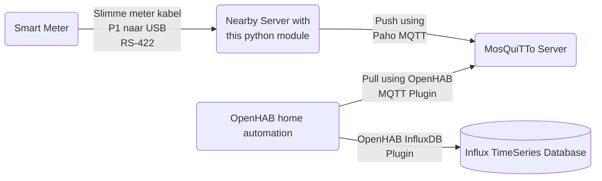

# Belgian SmartMeter P1 Port to MQTT Project

## Introduction

### Purpose
Purpose of this project is to read information from the Belgian Smart Meter P1 Port and either:
* display it on `stdout`
* or log it using python `logging` module
* or send it to domotic applications through MQTT (using `paho-mqtt`)

As per Belgian standards, Electricity Smart Meters are to be installed in a room with access
to the street (so Firefighters and Medical Teams can cut the individual power
supply of the house before intervention).

This places the Electricity Smart Meter in a usually inconvenient situation as it's unlikely
to be colocated with the location of the Home Automation hardware.

## How to use

### Required Python Packages

Make sure Python 3.10+ is installed on the machine that will be connected
to the Smart Meter.

The following packages are required. They can all be installed using pip:

    pip install paho-mqtt
    pip install pytz
    pip install tzlocal
    pip install croniter
    pip install pyserial
    pip install jsonschema

### Get the latest release

The [latest release](https://github.com/vivienbo/belgian-smartmeter-p1-to-mqtt/releases/latest) is available on github
by clicking this link.

### Customize the configuration

In the `/config` folder of the package, you need at minima to rename:
* `config.json.example` to `config.json`
* `logger_config.json.example` to `logger_config.json`

Documentation on the config.json section is available in [docs/configuration.md](https://github.com/vivienbo/belgian-smartmeter-p1-to-mqtt/tree/main/docs/configuration.md).

Documentation of the logger_config.json is available [on docs.python.org](https://docs.python.org/3/library/logging.config.html) as it simply loads the JSON and pass it as a `logging.config` input.

### Typical Use Case

In my case, I have a computer located closeby to the Electricity Smart Meter however the home automation
server (powered by [OpenHAB](https://www.openhab.org/)) is in another, more central room of the building.

I therefore needed an application that could read from the P1 Port and transmit it to a MQTT server
(in this case: [MosQuiTTo](https://mosquitto.org/)).

The connection between the P1 Port and the Computer is achieved using a ["Slimme Meter Kabel - P1 USB"](https://webshop.cedel.nl/Slimme-meter-kabel-P1-naar-USB#ProductReviewText) manufactured by [Cedel](https://cedel.nl/).

To summarize it as a diagram the setup looks as follow:

## Tested Use Cases
* **Meter**: Should work with any Smart Meter following Belgian standards (derived from the [DSMR 5.0.2 standard](https://www.netbeheernederland.nl/_upload/Files/Slimme_meter_15_a727fce1f1.pdf)). Tested with:
    * Siconia S211 (Fluvius, Ores)
    * Siconia T211 (Fluvius, Ores)
* **Reader Workstation**:
    * Operating System: Windows Server 2022
    * Driver: [FTDI driver](https://ftdichip.com/drivers/)
    * Python: version 3.11.2
* **MQTT Server**: Mosquitto version 2.0.14
* **OpenHAB Server**: OpenHAB version 3.4

## Known Limitations

* None remaining, open an issue if you find a bug or need an enhancement

## TODO

* Nice to have :: Windows Service Wrapper? Linux Service Wrapper?
