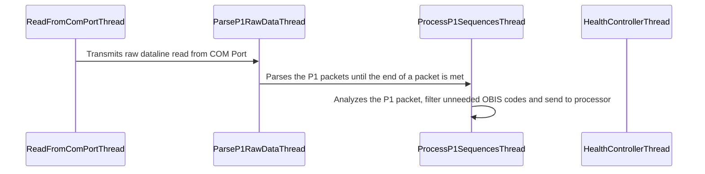

# Belgian SmartMeter P1 Port to MQTT Project

## Introduction

### Purpose
Purpose of this project is to read information from the Belgian Smart Meter P1 Port and send it to domotic applications through MQTT.

As per Belgian standards, Electricity Smart Meters are to be installed in a room with access to the street (so Firefighters and Medical Teams can cut the individual power supply of the house before intervention).

This places the Electricity Smart Meter in a usually inconvenient situation as it's unlikely to be colocated with the location of the Home Automation hardware.

### Typical Use Case

In my case, I have a computer located closeby to the Electricity Smart Meter however the domotic server (powered by [OpenHAB](https://www.openhab.org/)) is in another, more central room of the building.

I therefore needed an application that could read from the P1 Port and transmitted to a MQTT server (in this case: [MosQuiTTo](https://mosquitto.org/)).

The connection between the P1 Port and the Computer is achieved using a ["Slimme Meter Kabel - P1 USB"](https://webshop.cedel.nl/Slimme-meter-kabel-P1-naar-USB#ProductReviewText) manufactured by [Cedel](https://cedel.nl/).

## Tested Use Cases
* **Meter**: Should work with any Smart Meter following Belgian standards (derived from the [DSMR 5.0.2 standard](https://www.netbeheernederland.nl/_upload/Files/Slimme_meter_15_a727fce1f1.pdf)). Tested with:
    * Siconia S211 (Fluvius, Ores)
    * Siconia T211 (Fluvius, Ores)
* **Reader Workstation**:
    * Operating System: Windows Server 2022
    * Driver: xxx driver
    * Python: version 3.11.2
* **MQTT Server**: Mosquitto version 2.0.14
* **OpenHAB Server**: OpenHAB version 3.4

## How to use

### Required Python Packages

The following packages are required. They can all be installed using pip:

    pip install paho-mqtt
    pip install pytz
    pip install tzlocal
    pip install croniter
    pip install pyserial

### TODO

## Architecture (TODO)

## Known Limitation

* Configuration File Format isn't checked
* If multiple values are returned in an OBIS entry, only the first value is returned
* Dates in values are not supported (eg in case of Water meter centralized by Electricity Smart Meter or for measuring peak consumption with Fluvius, not yet used by Ores and Resa)

## TODO

* Make the HealthControllerThread counter configurable via the JSON config file
* Document the configuration file format
* MQTT only supports SSL, requires a certificate called "readp1.crt" in the same folder as main.py and is in the end not checked (security concern)
* Timezone is forced to Europe/Brussels (well, it's for Belgian metters right?)
* Implement a logger instead of printing to console
* Nice to have :: Windows Service Wrapper? Linux Service Wrapper?